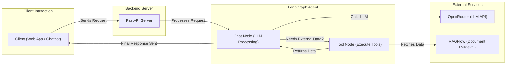

# Requirement
- Build a simple chatbot that can retrieve employee information
- Tool: CopilotKit, Langgraph, OpenRouter, RagFlow

# Architecture

# Tools:
1. Copilotkit
2. FastAPI
3. RAGFlow
4. OpenRouter
# Set-up
1. Get an example of CopilotKit
2. Set up local for Copilot Provider
3. Router 

