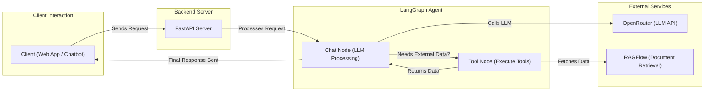

# Requirements

- Build a simple chatbot that can retrieve employee information.
- Tools: CopilotKit, LangGraph, OpenRouter, RAGFlow.
# Tools

### 1. CopilotKit - Next.js

- We have a running application and want to integrate an assistant or chatbot within it → Here, we use CopilotKit.
- If we already have an agent powered by LangGraph and want to turn it into a Co-Agent within our application → We use CoAgents (LangGraph).

### 2. LangGraph - FastAPI

- Used to build the AI agent.

### 3. RAGFlow

- An open-source RAG (Retrieval-Augmented Generation) system that helps embed data.
- Provides an HTTP API or SDKs for Python and TypeScript for third-party integration.

### 4. OpenRouter

- A centralized hub for LLMs.
- Purchase an OpenRouter API key → Handles:
    - Model routing.
    - Balancing price and performance.

# High Level-Architecture

# Set-up

### 1. OpenRouter

- Purchase credits → Get an API key.

### 2. RAGFlow

- **For macOS:** Follow the instructions [here](https://ragflow.io/docs/dev/build_docker_image).
- **For other OS:** Follow the setup guide in [this repository](https://github.com/infiniflow/ragflow).
- Access RAGFlow at `http://127.0.0.1/`, create an account, and configure:
    - Embedding model.
    - Chat model.
    - Other settings.
- **Note:** I attempted to connect with OpenRouter and Ollama Embedding, but it failed. Instead, I purchased an OpenAI API key for integration.

### 3. ui

- Follow the steps in `ui/README.md`.

### 4. agent

- Follow the steps in `agent/README.md`.