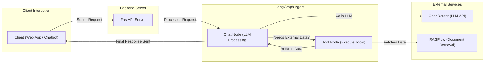

# Requirements
- Build a simple chatbot that can retrieve employee information
- Tool: CopilotKit, Langgraph, OpenRouter, RagFlow

# Tools:
1. Copilotkit - NextJs
	- We have a running application and then we want to have a assistant or chatbot live inside of that -> here, we use Copilot
	- If we already have agent (powerd by Langgraph) and want to turn it into a Co-Agent with our application -> we use CoAgents (LangGraph)
2. Langgraph - FastAPI
	- Use this to build Agent
3. RAGFlow
	- This is an Open-Source RAG (Retrieval-Augmented Generation) that helps us embed our data into its system
	- Provide http api or python, typescript sdk for usage as a third-party
4. OpenRouter
	- A centralize hub for LLMs
	- Go and By OpenRouter api key -> it is gonna handle the:
		- Model Routing
		- Balance between Price and Performance

# High Level-Architecture

# Set-up

1. OpenRouter
	- Go and Buy credit -> Get the API_KEY
2. RagFlow
	- For macos, follow this link:
		- https://ragflow.io/docs/dev/build_docker_image
	- For others:
		- https://github.com/infiniflow/ragflow, follow as usual
	- Go to [http://127.0.0.1](http://127.0.0.1/), create an account then do the configuration:
		- Embedding model
		- Chat Model
		- ....
	- I tried to connect with OpenRouter and Ollama Embedding but it's failed -> So I bought OpenAI API key to work.
3. Frontend
	- Follow step in ui/README.md
4. Backend
	- Follow step in agent/README.md
