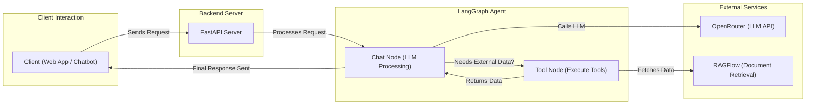
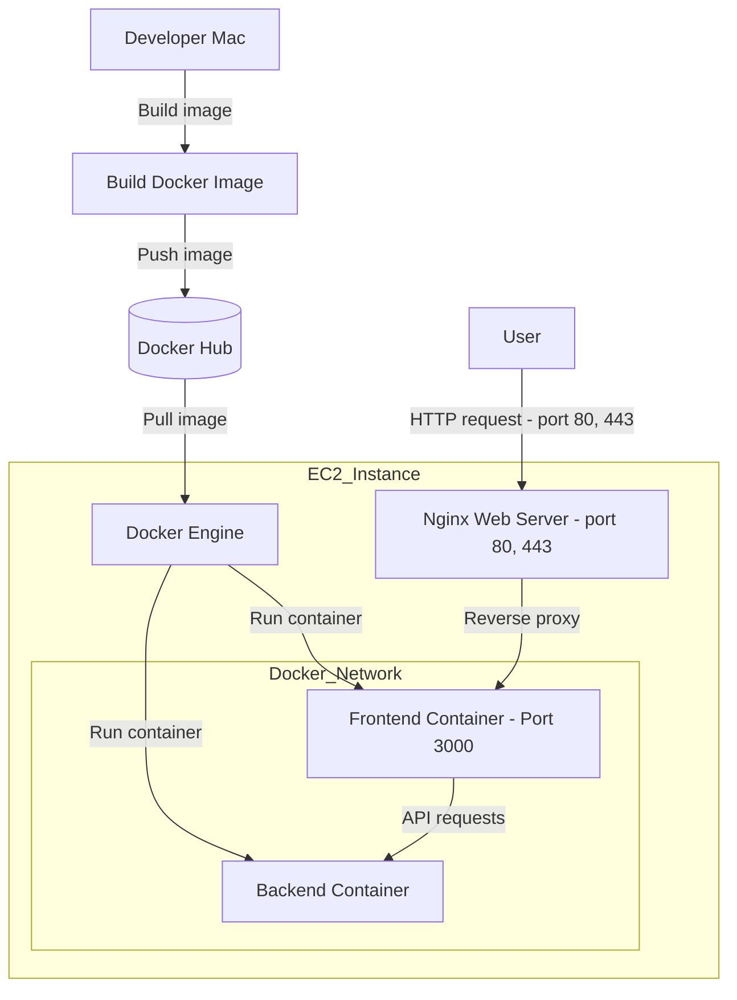

# Requirements

- Build a simple chatbot that can retrieve employee information.
- Tools: CopilotKit, LangGraph, OpenRouter, RAGFlow.
# Tools

### 1. CopilotKit - Next.js

- We have a running application and want to integrate an assistant or chatbot within it → Here, we use CopilotKit.
- If we already have an agent powered by LangGraph and want to turn it into a Co-Agent within our application → We use CoAgents (LangGraph).

### 2. LangGraph - FastAPI

- Used to build the AI agent.

### 3. RAGFlow

- An open-source RAG (Retrieval-Augmented Generation) system that helps embed data.
- Provides an HTTP API or SDKs for Python and TypeScript for third-party integration.

### 4. OpenRouter

- A centralized hub for LLMs.
- Purchase an OpenRouter API key → Handles:
    - Model routing.
    - Balancing price and performance.

# High Level-Architecture


# Set-up

### 1. OpenRouter

- Purchase credits → Get an API key.

### 2. RAGFlow

- **For macOS:** Follow the instructions [here](https://ragflow.io/docs/dev/build_docker_image).
- **For other OS:** Follow the setup guide in [this repository](https://github.com/infiniflow/ragflow).
- Access RAGFlow at `http://127.0.0.1/`, create an account, and configure:
    - Embedding model.
    - Chat model.
    - Other settings.
- **Note:** I attempted to connect with OpenRouter and Ollama Embedding, but it failed. Instead, I purchased an OpenAI API key for integration.

### 3. ui

- Follow the steps in `ui/README.md`.

### 4. agent

- Follow the steps in `agent/README.md`.

# Deployment
## 1. Diagram

## 2. Build images and Push to Docker Hub
- Go to https://hub.docker.com/ login and create two repositories:
	- `chatagent_backend`
	- `chatagent_copilokit`
- Build and push images:
```sh
docker buildx build \
  --platform linux/amd64,linux/arm64 \
  -t bangnguyen781209/chatagent_backend:latest \
  --push .
```

```sh
docker buildx build \
  --platform linux/amd64,linux/arm64 \
  -t bangnguyen781209/chatagent_copilokit:latest \
  --push .
```
## 3. Setup EC2:
### 3.1 Create AWS account
### 3.2 Launch a free EC2 instance
Note:
```
When launching a new instance remember to save the ssh-key
```
### 3.3 Access to ec2 instance
```
ssh -i ~/path/to/key.pem ec2-user@your.ec2.url
```
### 3.4 Install Docker
```sh
sudo dnf install -y docker
```

```sh
sudo systemctl start docker
```
#### Enable docker to start on boot
```sh
sudo systemctl enable docker
```
#### Fix docker engine permission:
```sh
sudo usermod -aG docker $USER
```

```sh
newgrp docker
```
#### Pull images and start containers:
```sh
docker pull bangnguyen781209/chatagent_backend:latest
docker pull bangnguyen781209/chatagent_coplilotkit:latest
```
#### Create network
```sh
docker network create agent-network
```
#### Setup env variables:
- ./backend/.env:
```
OPENAI_API_KEY=openai_api_key
OPENROUTER_API_KEY=openrouter_api_key
```
- ./ui/env:
```
OPENAI_API_KEY=openai_api_key
REMOTE_ACTION_URL=http://backend:8000/copilotkit
```
#### Start container:
```sh
docker run -d --name backend --network agent-network --env-file ./backend/.env -p 8000:8000 chatagent_backend
```

```sh
docker run -d --network agent-network --env-file ./ui/.env -p 3000:3000 chatagent_copilotkit
```
